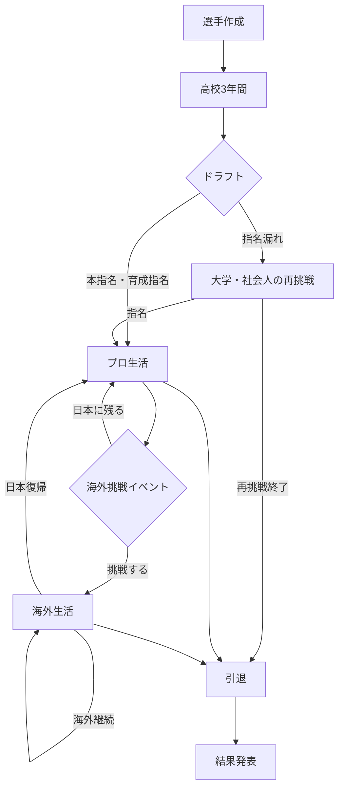

# 03 キャリアフロー設計書

## 1. 文書情報

- バージョン：v0.2（シンプル版）
- 目的：短時間で最後まで遊べる一本道を基本に、重要場面だけを分岐させる。

## 2. 全体フロー



日本代表、トレード、戦力外は独立ステージにせず、プロ生活中の特別イベントとして扱う。

## 3. 状態

ゲーム全体の状態は次の6つだけにする。

- `CREATION`：選手作成
- `HIGH_SCHOOL`：高校
- `RETRY`：大学・社会人再挑戦
- `PRO_JAPAN`：日本プロ
- `PRO_OVERSEAS`：海外
- `RETIRED`：引退

一軍・二軍、マイナー・メジャーは状態内の所属レベルとして保持する。

## 4. 高校編

各学年は春、夏、秋、冬の4ターン。

```text
高校1年：基礎育成とレギュラー争い
高校2年：能力強化と大会実績
高校3年：最後の大会とドラフト評価
```

各ターンで育成またはイベントを1回選び、大会ターンでは結果をまとめて表示する。

高校3年冬にドラフト結果を表示する。

## 5. 指名漏れ後

大学・社会人は長い独立モードにしない。

1. 大学または社会人を選ぶ。
2. 年1回、成長方針を選ぶ。
3. 成長と成績をまとめて表示する。
4. 条件を満たした年にドラフトへ再挑戦する。

大学は最大4ターン、社会人は最大3ターンとする。最大ターン数を超えた場合は引退へ進む。

## 6. プロ生活

1年を3ターンで進める。

```text
春：キャンプ・能力育成・一軍判定
シーズン：年間成績・昇降格・特別イベント
冬：契約更改・移籍・海外・引退判断
```

### 所属レベル

- 育成
- 二軍
- 一軍
- 故障中

登録日数や細かな昇降格履歴は管理しない。年間成績にはその年の主な所属を記録する。

## 7. 特別イベント

プロ生活中に条件付きで発生する。

- 覚醒・スランプ
- 軽傷・重傷
- 一軍昇格・二軍降格
- トレード
- 戦力外と再契約
- 日本代表
- 海外挑戦
- 引退勧告

イベントは画面に本文と2〜4個の選択肢を表示し、選択後すぐ結果を返す。

日本のドラフト指名球団とトレード先は自動決定する。FAでは複数球団のオファーから選択できる。

## 8. 海外生活

海外は架空30球団・2リーグ制とし、所属レベルは2つだけにする。

- マイナー
- メジャー

1年の進行は日本プロと同じ3ターン。挑戦時は最大3球団のオファーから選び、契約後はマイナーまたはメジャーから開始する。契約制度は再現せず、シーズン終了時に「海外継続」「日本復帰」「引退」の候補を判定する。

## 9. 日本代表

日本代表は一時イベントとして扱う。

```text
好成績
  ↓
代表選出判定
  ↓
大会結果と能力・人気への補正
  ↓
通常の所属へ戻る
```

大会名は、条件に応じて「U-18ワールドカップ」「プレミア12」「ワールド・ベースボール・クラシック」「オリンピック」と表示する。開催周期や対象年齢はマスターデータで管理する。

## 10. 引退

次の条件で引退イベントを出す。

- 高齢または能力低下
- 戦力外後に契約なし
- 重傷
- プレイヤーが自ら選択

引退後は、通算成績、タイトル、代表歴、年俸、年表、称号を集計して結果画面へ進む。

## 11. 中断と再開

- 各選択確定後に自動保存する。
- 起動時に「続きから」を表示する。
- 保存するのは現在状態、Seed、乱数位置、能力、成績、履歴、バージョン。
- 1つ前の正常データをバックアップとして保持する。

## 12. 進行不能への対策

- 有効なイベントがない場合は汎用イベントを表示する。
- 契約先がない場合は戦力外イベントまたは引退へ進める。
- 能力値は必ず0〜100へ収める。
- 選択肢確定中は連打を無効にする。
- セーブ破損時はバックアップを読み込む。

## 13. 暫定値

- 高校12ターン、プロ年3ターン
- 大学・社会人の最大再挑戦回数
- 海外挑戦の出現条件
- 最大現役年数

## 14. 確定事項

- 育成指名は育成レベルから開始し、支配下イベント後に二軍・一軍へ進む。
- 海外から日本へ復帰する場合は、最大3球団のオファーから選択する。
- 国際大会は大会ごとの詳細名称を表示する。
